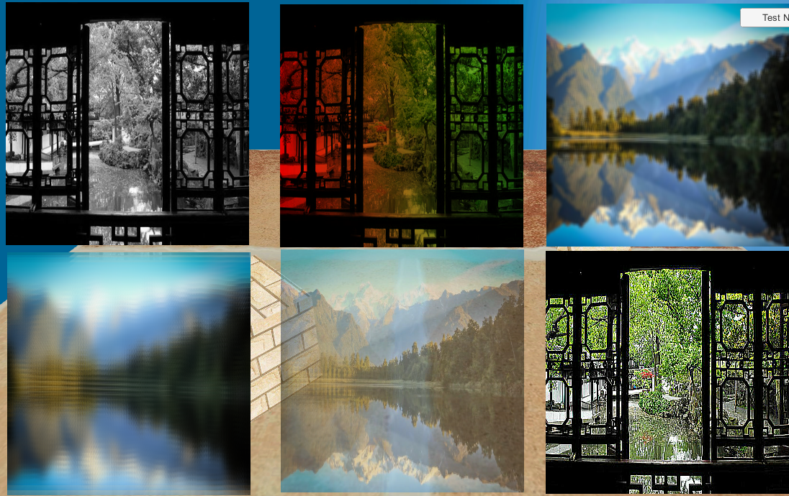
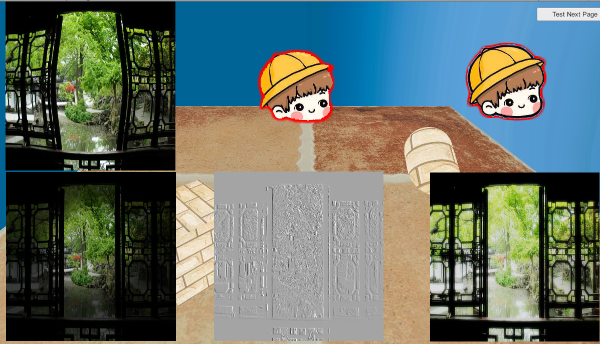

# Image-Effect

## Introduction
These materials contains many post-process effects for UGUI Image-Component. Blew figures are screenshots of those effects. 
 
 
Unity Store link:https://assetstore.unity.com/packages/vfx/shaders/uguiimageshaderpack-85897

## Support Platform
Android  
IOS  
Windows

## Graphic API
OpenGL ES 2.0+  
Metal  
DirectX 9+  
